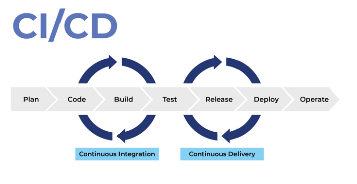

- CI/CD
    - O que é CI/CD

        Pratica combinada de entrega e integração continua

        

        - **C**ontinuous **I**ntegration
            - Automatizar o build e testes toda vez que desenvolvedores integram código ao repositório para garantir que este novo código não está quebrando build e nem falhando em testes
        - **C**ontinuous **D**elivery
            - "CD" se refere à entrega contínua e/ou à implantação contínua, conceitos relacionados e usados alternadamente às vezes. Em ambos os casos, se trata da automação de fases avançadas do pipeline, mas são usados às vezes separadamente para ilustrar o nível de automação presente.
    - Ferramentas
        - [Jenkins](https://www.jenkins.io)
            - O que é?
                - Ferramenta de automatização open-source
                - Free
                - Pode automatizar a integração entre outras tarefas
                - Sua maior vantagem é a sua popularidade e quantidade de Plugins disponíveis
                - É desenvolvido em Java
                - Gerenciamento de usuários
                - Escala facilmente
                - Suporte a pipelines e arquivo declarativo (Jenkinsfile)
            - O que ele faz?
                - Executa processos de interação contínua( build, test, performance, tarefas necessárias para a a verificação do funcionamento do software)
                - Gera um relatório apresentando todos os passos executados
                - Realiza o processo de deploy de forma automatizada 
                  

        - GitHub Actions
            - O que é?
                - Orquestrador de workflow

                - Orientado a eventos

                - Possui plano Free limitado
            - O que faz?
                - Crie Actions no seu repositório

                    - **Workflow**: É onde vamos descrever todo o processo de automação para podermos compilar, testar e fazer deploy do nosso sistema.

                    - **Actions**: São tarefas que vamos utilizar dentro do workflow. Aqui que vamos definir o que realmente nosso workflow vai fazer.
                    
                

---

**Fonts:**

[O que é CI/CD](https://www.redhat.com/pt-br/topics/devops/what-is-ci-cd) - RedHat

[Undestanding GitHub Actions](https://docs.github.com/en/actions/learn-github-actions/understanding-github-actions) - github